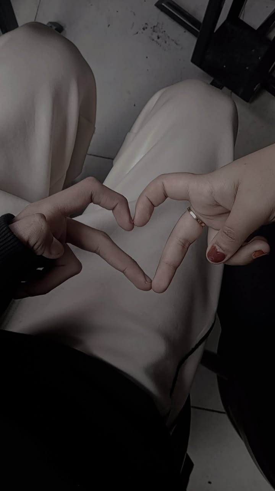
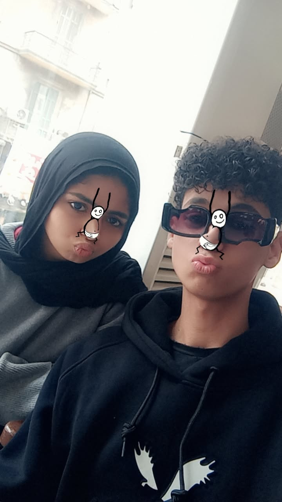
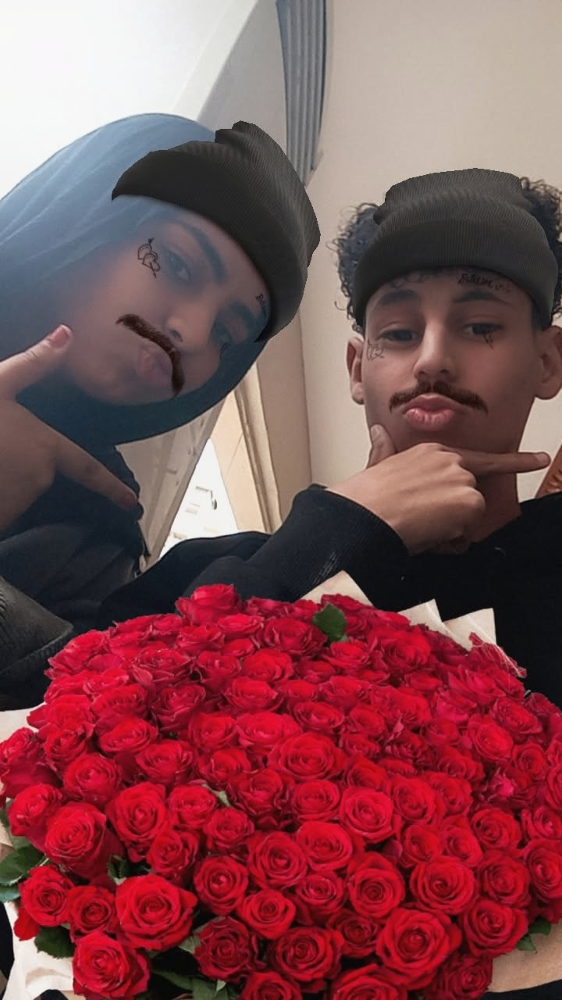
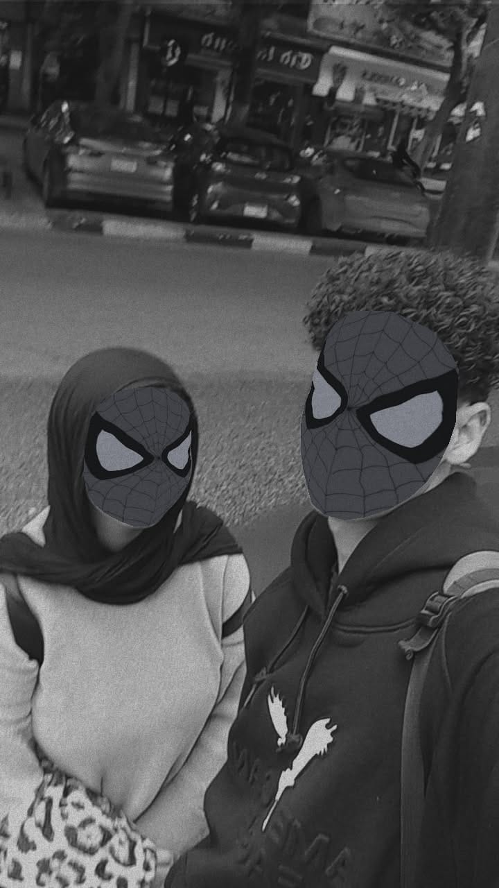
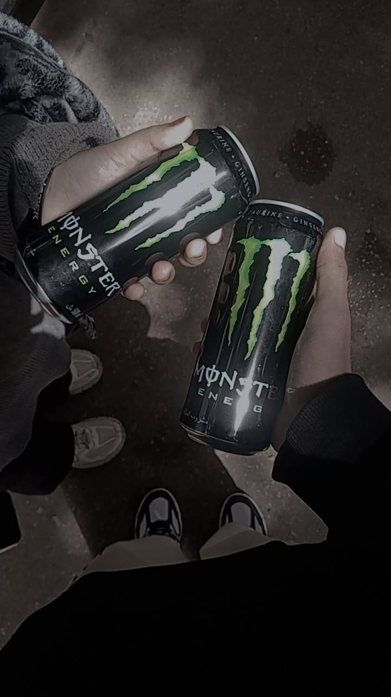
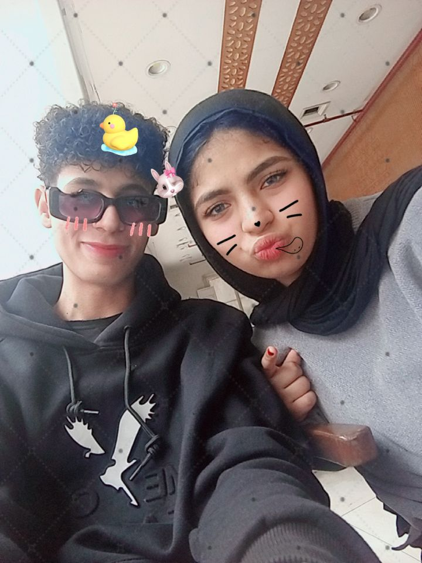
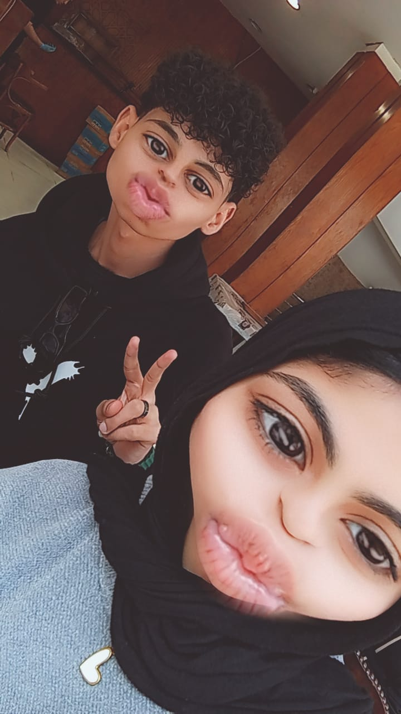
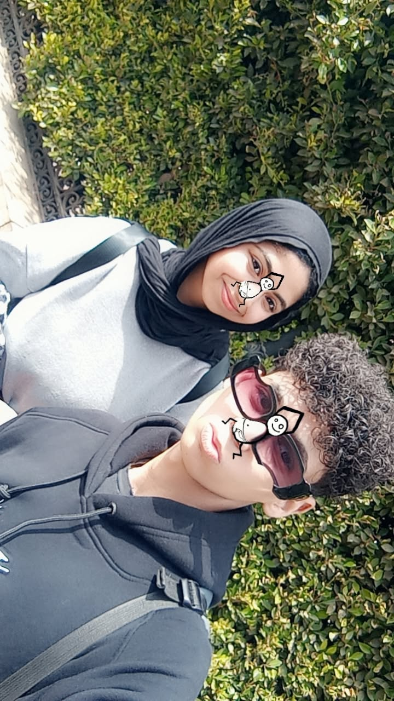

<!DOCTYPE html>
<html lang="ar">
<head>
<meta charset="UTF-8">
<meta name="viewport" content="width=device-width, initial-scale=1.0">
<title>A ❤️ E</title>

</head>

<body>

<!-- قلوب -->

<!-- الصفحة 1 -->

<h2>اكتب الباسورد ✉️</h2>

<input type="password" id="pass">

<button onclick="checkPass()">فتح</button>

<!-- الصفحة 2 -->

يا سنفورتي الجميلة ❤️  

الموقع ده معمول علشان يفضل ذكرى لينا احنا الاتنين…  
من أول يوم اتعرفنا فيه يوم **30 / 6 / 2023**  
والدنيا بقت أحلى بوجودك فيها.  

كل خروجة خرجناها…  
كل ضحكة…  
كل هزار بينا…  
كل لحظة كنتي فيها جنبي  
فضلت محفورة جوايا.  

انتي مش بس حد في حياتي…  
انتي حتة من يومي…  
من مزاجي…  
من ضحكتي.  

وأنا مبسوط إن كل الحاجات الحلوة دي كانت معاكي انتي بالذات.  

الموقع ده معمول علشان كل ما تفتحيه  
تفتكري إن في حد فرحان بوجودك في حياته  
وإن الذكريات اللي بينا  
غالية عندي جدًا.  

<button onclick="nextPage(3)">التالي</button>

<!-- الصفحة 3 -->

<audio autoplay controls loop>
<source src="song.mp3">
</audio>

<video width="100%" controls>
<source src="VID-20260327-WA0023.mp4">
</video>

<button onclick="nextPage(4)">التالي</button>

<!-- الصفحة 4 -->

<h2>الوقت اللي قضيناه مع بعض ⏳</h2>

0

يوم

0

ساعة

0

دقيقة

0

ثانية

</body>
</html>
